# ASD Essential 8 Security Controls – Implementation Project

## 1. Overview

The **ASD Essential 8** is a cybersecurity baseline developed by the **Australian Cyber Security Centre (ACSC)** to help organisations reduce cyber risk and uplift their security posture.

This project demonstrates the implementation of all eight controls across a mixed Windows and Linux environment, including:

- Windows 10/11
- Ubuntu 22.04
- Kali Linux
- Google Chrome
- Microsoft Edge

The goal of this project is to showcase practical system hardening, patching, access control, MFA, and backup strategies aligned with Australian government standards.

---

## 2. Environment

- Windows 10/11 Pro
- Ubuntu 22.04 LTS
- Kali Linux
- Google Chrome
- Microsoft Edge

---

## 3. Essential 8 Implementation

### 🛡️ 1. Application Whitelisting (Windows)

#### Concept
Application whitelisting ensures only approved applications can run, reducing malware execution risk.

#### Implementation
- Opened **Local Security Policy** (`secpol.msc`)
- Configured **Software Restriction Policies**
- Set default security level to **Disallowed**
- Applied policies to **All users except local administrators**
- Restricted **Trusted Publishers** management to admins
- Enabled **AppLocker** rule enforcement
- Created **Default Rules**
- Automatically generated executable rules for **Program Files**

#### Screenshots

##### Local Security Policy
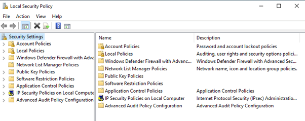

##### Security Levels (Disallowed)
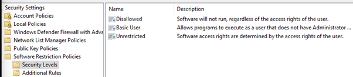

##### Warning prompt
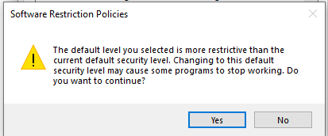

##### Enforcement Properties
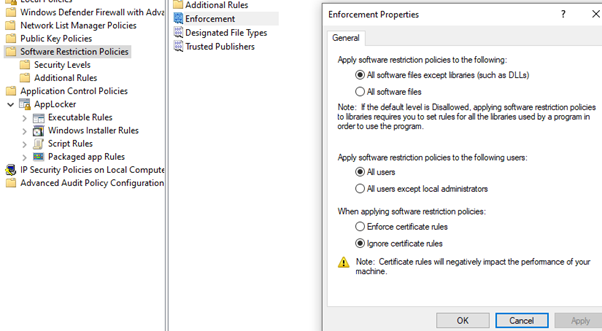

##### Trusted Publishers
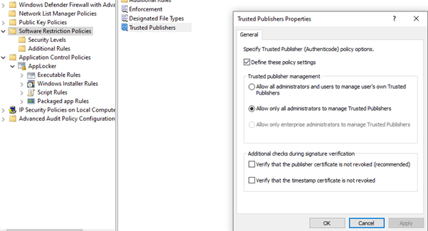

##### AppLocker rule enforcement
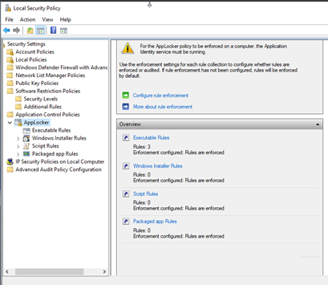

#### Software Restriction Policies
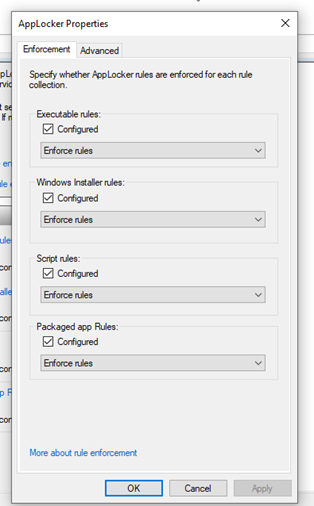

#### Default Rules creation
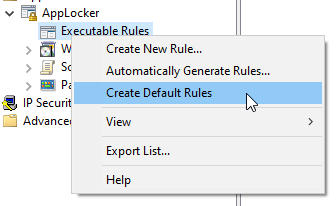
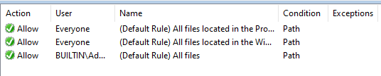

#### Automatically Generated Rules
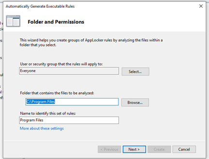.
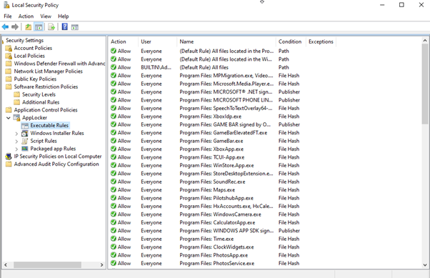.

#### Outcome
Only authorised applications can run, significantly reducing the attack surface.

---

### 🛠️ 2. Patch Applications (Linux)

#### Concept
Keeping applications patched prevents exploitation of known vulnerabilities.

#### Implementation
- Compared file versions using `diff`
- Used `patch` to apply changes
- Created patch files using unified diff format
- Demonstrated patching workflow using text files

#### Screenshots
##### `file1.txt`
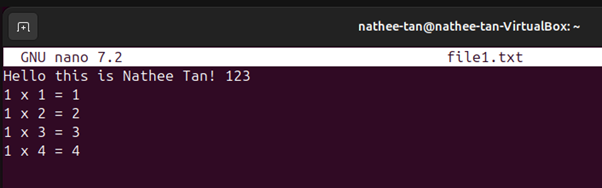

##### `file2.txt`
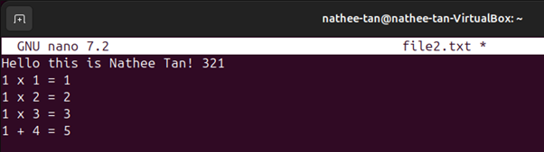

##### `man diff`
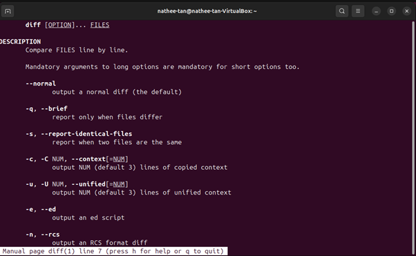

##### `diff -y` output
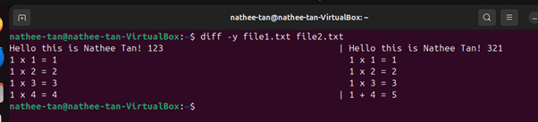

##### `diff -c` output
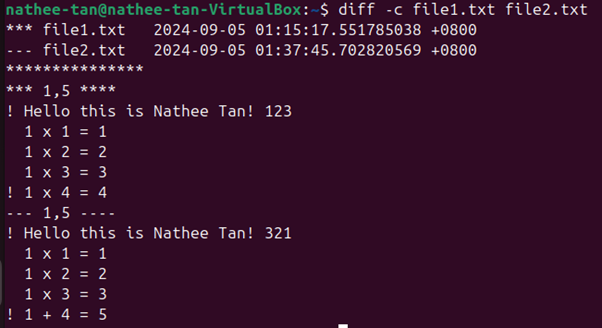

##### `man patch`
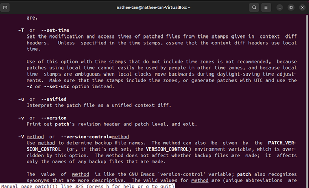

##### Creating patch file
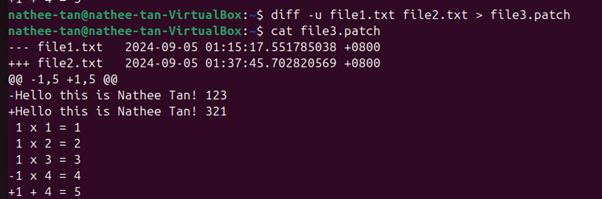

##### Running patch
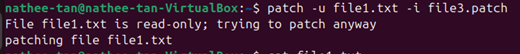

##### Patched file result
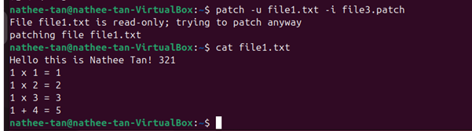

#### Outcome
Understanding of patching workflows and version control using Linux tools.

---

### 📄 3. Configure Microsoft Office Macro Settings

#### Concept
Macros can contain malicious code. Disabling them prevents malware execution.

#### Implementation
- Accessed **Trust Center**
- Disabled all macros
- Allowed only digitally signed macros
- Reviewed trusted locations

#### Screenshots
##### Options -> Trust Center
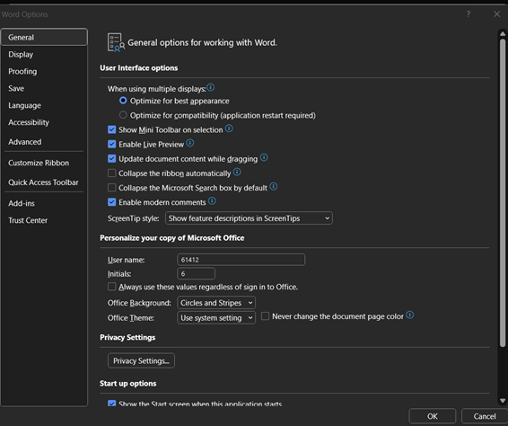

##### Trust Center Settings
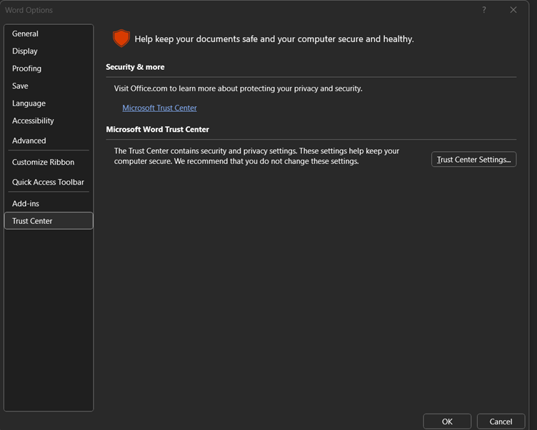

##### Macro Settings
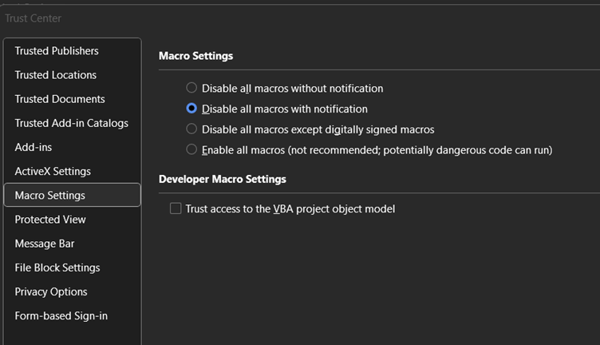
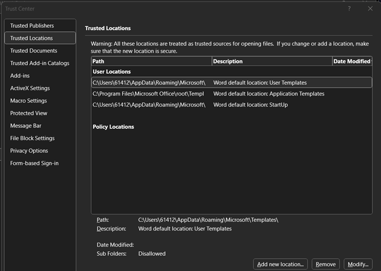

##### Trusted Locations


#### Outcome
Reduced risk of macro-based malware.

---

### 🌐 4. User Application Hardening (Chrome & Edge)

#### Concept
Browser hardening prevents malicious scripts, ads, and insecure connections.

#### Chrome Hardening
- Enabled **Enhanced Protection**
- Forced **HTTPS-only mode**
- Blocked third-party cookies
- Reviewed permissions (location, camera, mic)

#### Edge Hardening
- Set **Tracking Prevention** to Strict
- Enabled **Potentially Unwanted App Blocking**
- Enabled **Enhanced Security Mode**

#### Screenshots:

**Chrome**
##### Privacy & Security
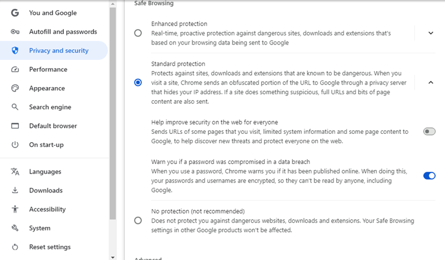

##### Ensuring Enhanced Protection is ON
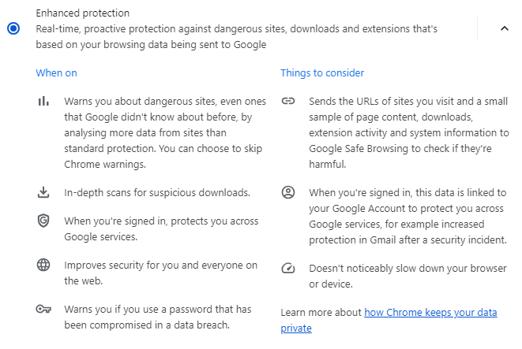

##### Secure Connections
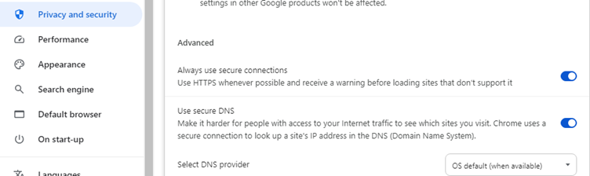

##### Third-party cookies
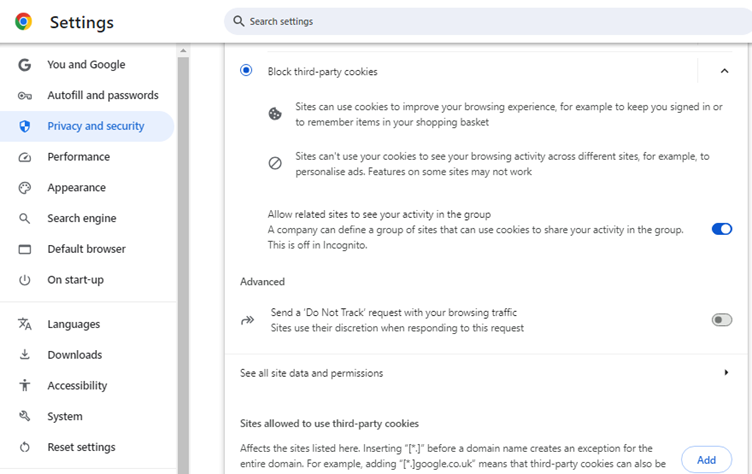

##### Permissions
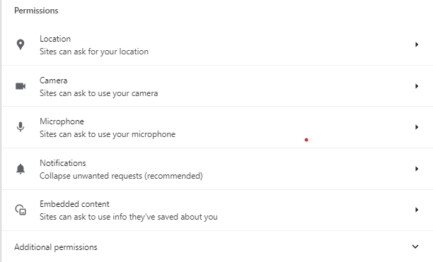

**Edge**
#### Privacy, Search & Services
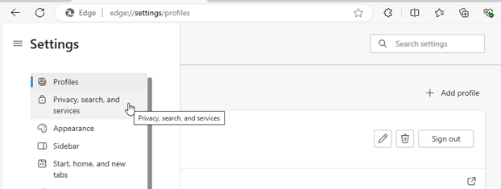

#### Tracking Prevention
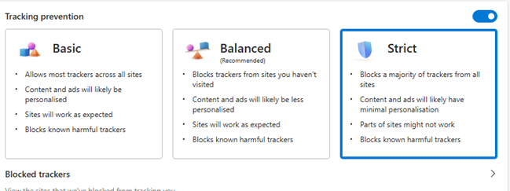

#### Exceptions
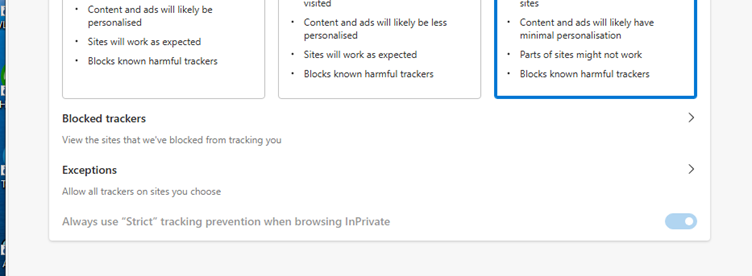
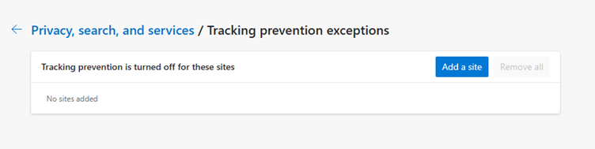

#### Potentially Unwanted Application (PUA) blocking
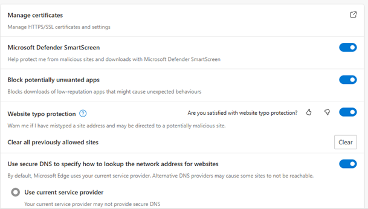

#### Enhanced Security Mode
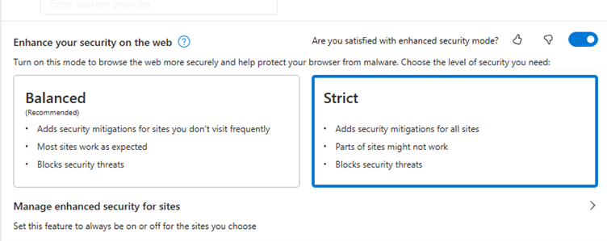

#### Outcome
Browsers hardened against common web-based threats.

---

### 🔐 5. Restrict Administrative Privileges (Linux)

#### Concept
Least privilege reduces the impact of compromised accounts.

#### Implementation
- Created group `my_group`
- Added multiple users
- Created sensitive directory and file
- Changed group ownership
- Configured directory and file permissions

#### Screenshots

#### 'addgroup'
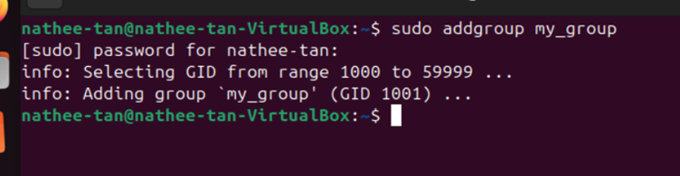

#### `adduser`
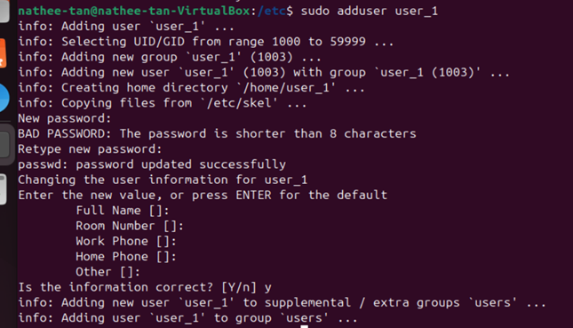

#### group membership
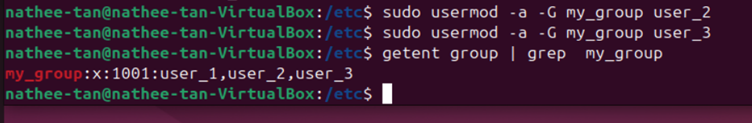

#### directory creation
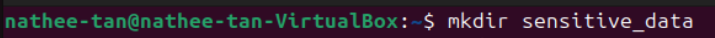

#### `chgrp`
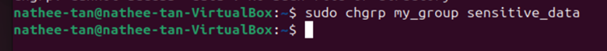

#### directory permissions
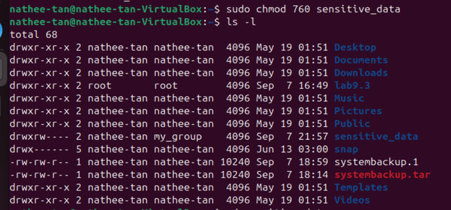

#### file permissions
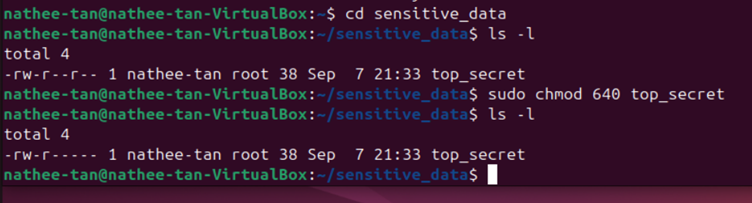

#### Outcome
Proper separation of privileges and secure access control.

---

### 💻 6. Patch Operating Systems
Patching operating systems is critical because updates fix security vulnerabilities, improve stability, and prevent attackers from exploiting weaknesses. Updates also improve performance and may include compatibility improvements for software and hardware.

#### Screenshots

#### Windows
Checked for updates under **Update & Security**
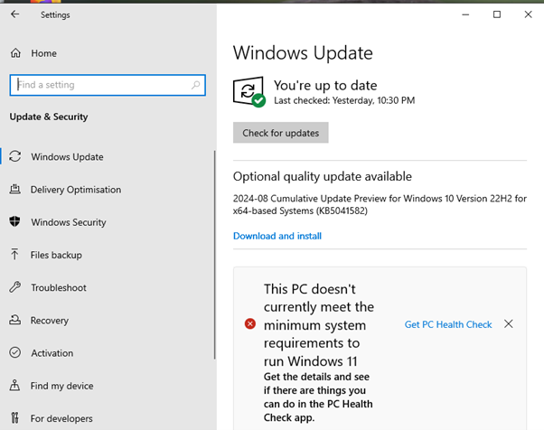

#### Linux
Ran:

```bash
sudo apt-get update
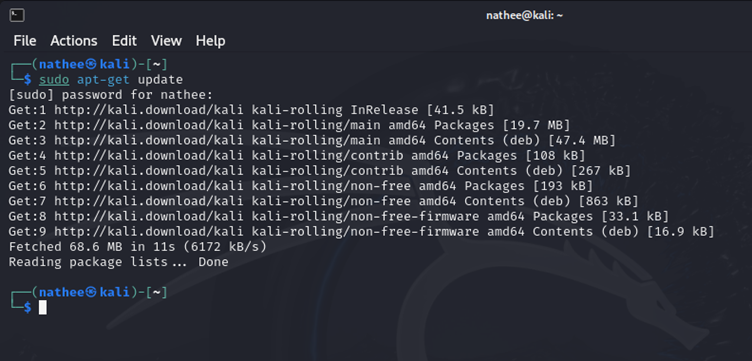

sudo apt-get upgrade
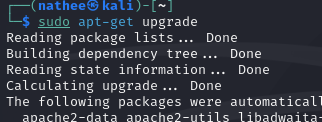

```
#### Outcome
Both Windows and Linux systems were successfully updated to the latest available patches. This reduces security vulnerabilities, improves system stability, and ensures the operating systems are protected against known exploits. Regular patching helps maintain smooth device performance and lowers the risk of attackers exploiting outdated software.

### 7. Multi-factor Authentication (MFA)
#### Concept
Multi-factor Authentication adds an extra layer of protection by requiring both a password and a second factor (such as a code from Google Authenticator). This prevents attackers from accessing accounts even if the password is compromised.

#### Implementation
Updated Ubuntu 22.04

Installed the Google-authenticator PAM module

Installed the Google Authenticator app on smartphone

Generated and scanned the QR code

Enabled 2FA for sudo

Tested two-factor login

Configured MFA for SSH

#### Screenshots
Updating Ubuntu
[Looks like the result wasn't safe to show. Let's switch things up and try something else!]

Installing Google-authenticator PAM module
[Looks like the result wasn't safe to show. Let's switch things up and try something else!]

Google Authenticator QR Code
[Looks like the result wasn't safe to show. Let's switch things up and try something else!]

Enabling 2FA for sudo
[Looks like the result wasn't safe to show. Let's switch things up and try something else!]

Testing MFA login
[Looks like the result wasn't safe to show. Let's switch things up and try something else!]

SSH MFA configuration
[Looks like the result wasn't safe to show. Let's switch things up and try something else!]

#### Outcome
Ubuntu now requires a second factor for authentication, significantly reducing the risk of unauthorised access.

### 💾 8. Daily Backups
#### Concept
Backups ensure important data can be restored after incidents such as ransomware, accidental deletion, or system failure. The tar command is used to create archive files and preserve directory structures for backup purposes.

#### Implementation
Using tar for backups

Created a new directory and three text files

Checked directory path using pwd

Ran the backup command:

bash
tar -cvpf systembackup.tar /home/nathee-tan/lab9.3
Verified the backup file using ls

Scheduling weekly backups (cron)

Opened cron editor using:

bash
crontab -e
Added a cron job to run every Friday at 18:59

Saved and exited

#### Screenshots
Creating directory and files
[Looks like the result wasn't safe to show. Let's switch things up and try something else!]

Checking directory path with pwd
[Looks like the result wasn't safe to show. Let's switch things up and try something else!]

Running tar backup
[Looks like the result wasn't safe to show. Let's switch things up and try something else!]

Backup file created
[Looks like the result wasn't safe to show. Let's switch things up and try something else!]

Opening crontab
[Looks like the result wasn't safe to show. Let's switch things up and try something else!]

Weekly backup cron job
[Looks like the result wasn't safe to show. Let's switch things up and try something else!]

#### Outcome
Backups are created and scheduled automatically, ensuring data can be restored quickly and reliably.

## Conclusion
This project demonstrates the full implementation of the ASD Essential 8 across Windows and Linux systems. Each control was configured, tested, and documented with screenshots to show practical understanding of system hardening, patching, access control, MFA, and backup strategies.

By completing all eight controls — Application Whitelisting, Patch Applications, Macro Settings, User Application Hardening, Restrict Administrative Privileges, Patch Operating Systems, Multi-factor Authentication, and Daily Backups — this environment now reflects a significantly improved security posture aligned with ACSC guidance.

The hands-on activities performed in this lab highlight real-world cybersecurity skills including OS administration, Linux command-line usage, privilege management, secure configuration, and backup automation.
