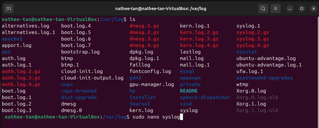
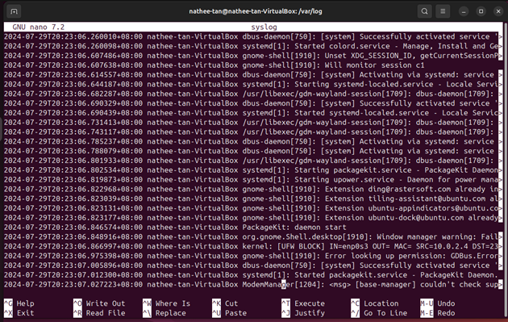
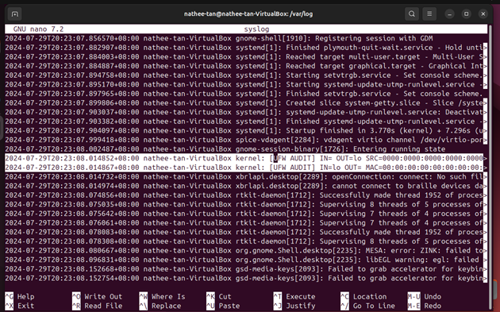
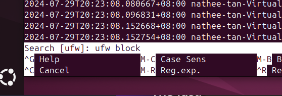
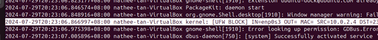
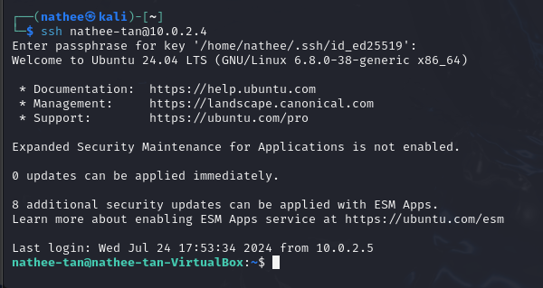
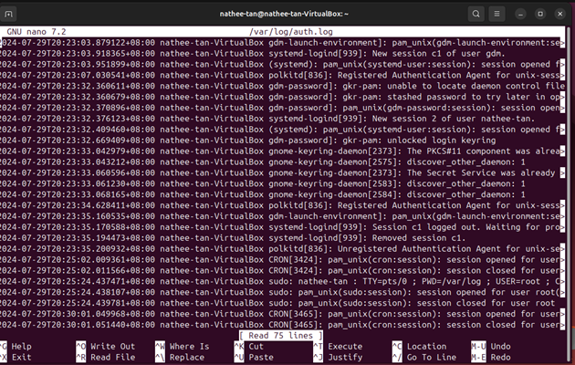
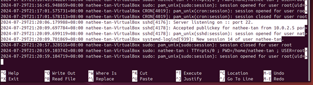

# Linux Log Analysis & Incident Detection Toolkit

A practical incident-response project built entirely from hands-on labs.

## 📌 Overview

This project demonstrates practical incident-response skills using real Linux system logs, forensic evidence collection, and shell-script automation.

All work showcased here is based exclusively on completed labs from the Institute of Data Cyber Security Program — no new commands, scans, or tools were used.

The project simulates how a junior SOC analyst or incident responder would:

- Review and interpret Linux system logs
- Identify suspicious authentication activity
- Collect and preserve digital evidence
- Automate detection using shell scripting

## 🧩 Project Components

This project is built from three interconnected labs:

### 1. Log Analysis

Analysed key Linux log files to identify authentication attempts, system events, firewall activity, and kernel warnings.

**Skills demonstrated:**

- `/var/log/syslog` review
- `/var/log/auth.log` authentication analysis
- `last` and `lastb` login history
- Kernel event review using `dmesg`
- Web server log inspection (`apache2/access.log`, `error.log`)
- Using `grep` and filters to isolate suspicious activity

#### Syslog Searches

Run the following command to open and inspect the syslog file:

```bash
sudo nano /var/log/syslog
```



##### syslog file



##### UFW firewall logs in syslog



##### Blocked packets

```bash
ufw block
```





#### SSH Login Attempts

##### SSH Login Attempt (Kali → Ubuntu)



##### Viewing Authentication Logs
`/var/log/auth.log`



##### Evidence of Opened SSH Session



- Kernel warnings
- Apache access/error logs

### 2. Digital Evidence Collection

Performed forensic acquisition of a USB device using industry-standard techniques.

**Skills demonstrated:**

- Identifying storage devices (`fdisk -l`)
- Mounting evidence drives
- Creating forensic images using `dd`
- Creating hashed forensic images using `dcfldd`
- Splitting large images into blocks
- Verifying image integrity using hashing

**Screenshots included:**

- USB detection
- Mounting directories
- `dd` imaging
- `dcfldd` imaging + MD5/SHA hashes
- Verification output

### 3. Incident-Response Automation

Developed shell scripts to automate detection tasks such as pattern matching and failed login extraction.

**Skills demonstrated:**

- Bash scripting fundamentals
- Variables, loops, conditions
- Pattern searching using `grep`
- Script-based extraction of failed login attempts
- Basic user-input validation

**Screenshots included:**

- Script creation
- Script execution
- Output showing failed login attempts
- Pattern-matching script output

## 🛡️ Why This Project Matters

This project demonstrates real-world SOC and IR capabilities:

- Log analysis is the foundation of SIEM work.
- Evidence collection is essential for digital forensics.
- Automation is critical for scaling detection.

Together, these labs form a cohesive incident-response workflow that recruiters can immediately recognise.

## 🧪 Tools & Technologies

- Linux (Ubuntu)
- Bash
- `syslog`, `auth.log`, `kern.log`
- Apache2 logs
- `dd`, `dcfldd`
- Hashing (MD5, SHA1, SHA256)
- `grep`, `journalctl`, `dmesg`
- Shell scripting
