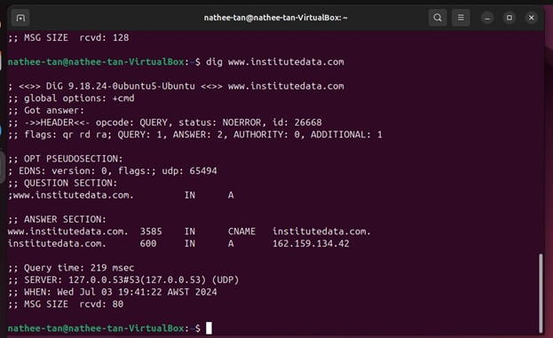
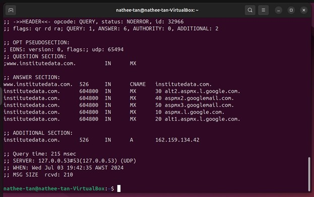
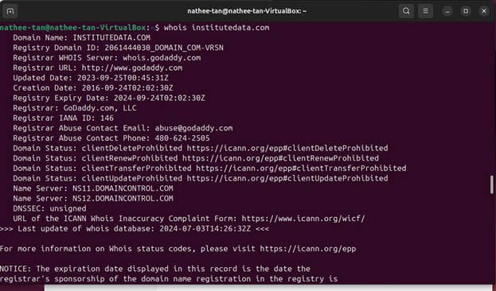
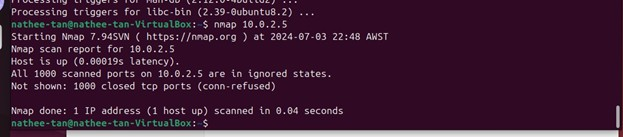
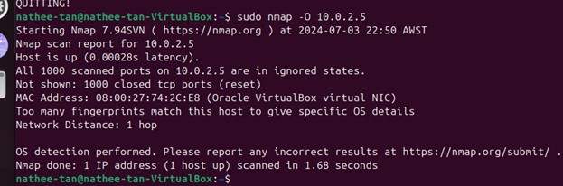
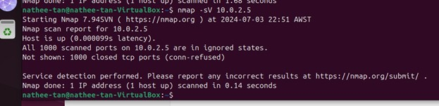
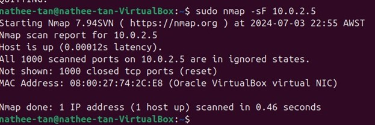

# Reconnaissance & Information Gathering

This project demonstrates practical reconnaissance techniques used to gather information about systems, domains, and networks.  
The focus is on **OSINT**, **DNS analysis**, **WHOIS investigation**, and **network scanning** — core skills for IT Support, SOC, and Cybersecurity roles.

---

## Google Hacking (OSINT)

Used advanced Google search operators to identify publicly exposed configuration files and database dumps.

### Key Findings
- Exposed Kickstart configuration file containing:
  - Plaintext root password (`ChangeMe`)
  - Firewall and SSH configuration
- Exposed MySQL dump containing:
  - User IDs  
  - Bidder IDs  
  - Email addresses  
  - Table creation statements  

### Skills Demonstrated
- OSINT methodology  
- Identifying misconfigurations  
- Recognising sensitive data exposure  

---

## DNS Enumeration (dig)

Performed DNS record analysis to understand domain infrastructure and mail routing.

### Key Findings
- Enumerated A, MX, and AAAA records for target domains
- Identified Google Workspace mail servers:
  - `aspmx2.google.com` → **173.194.202.27**
  - `aspmx3.googlemail.com` → **140.250.141.26**
- Retrieved IPv6 records for target hosts

### Skills Demonstrated
- DNS troubleshooting  
- Email server identification  
- IPv4/IPv6 record analysis  

### Screenshots

```bash
dig ANY <domain>
```



```bash
dig MX <domain>
```



---

## WHOIS Lookup

Investigated domain registration details to understand ownership and administrative contacts.

### Key Findings
- Retrieved registrar, organisation, and contact information
- Compared public vs. private domain registration and its impact on OSINT

### Skills Demonstrated
- WHOIS analysis  
- OSINT profiling  

### Screenshot


---

## Network Scanning (Nmap)

Conducted host discovery, port scanning, OS fingerprinting, and service enumeration on a target Linux VM.

### Key Findings
- Confirmed host availability and MAC vendor (VirtualBox)
- Identified closed and filtered ports
- Performed:
  - OS detection  
  - Version detection  
  - Stealth SYN scan  
  - FIN scan  
  - No‑ping OS scan  

### Skills Demonstrated
- Network enumeration  
- OS fingerprinting  
- Service version detection  
- Stealth scanning techniques  

### Screenshots
**Basic Scan:**  


**OS Detection:**  


**Version Detection:**  


**Stealth Scans:**  


---

## Skills Summary

- OSINT (Google Dorking)
- DNS analysis (dig)
- WHOIS investigation
- Network scanning (Nmap)
- Identifying exposed credentials and misconfigurations
- Understanding domain and email infrastructure
- Interpreting scan results and network behaviour
